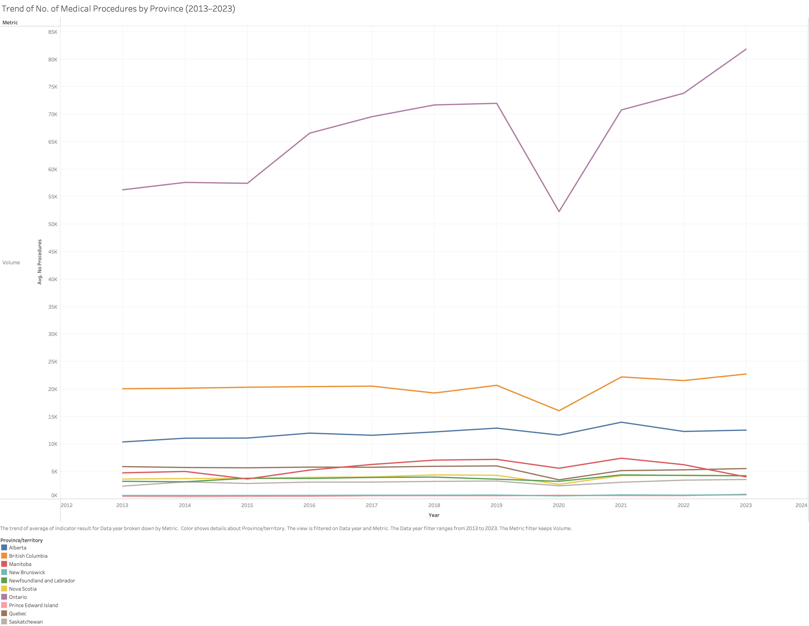
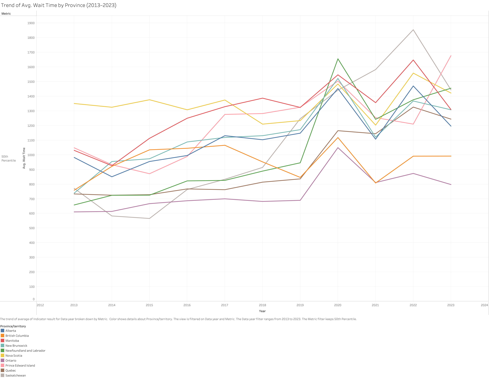
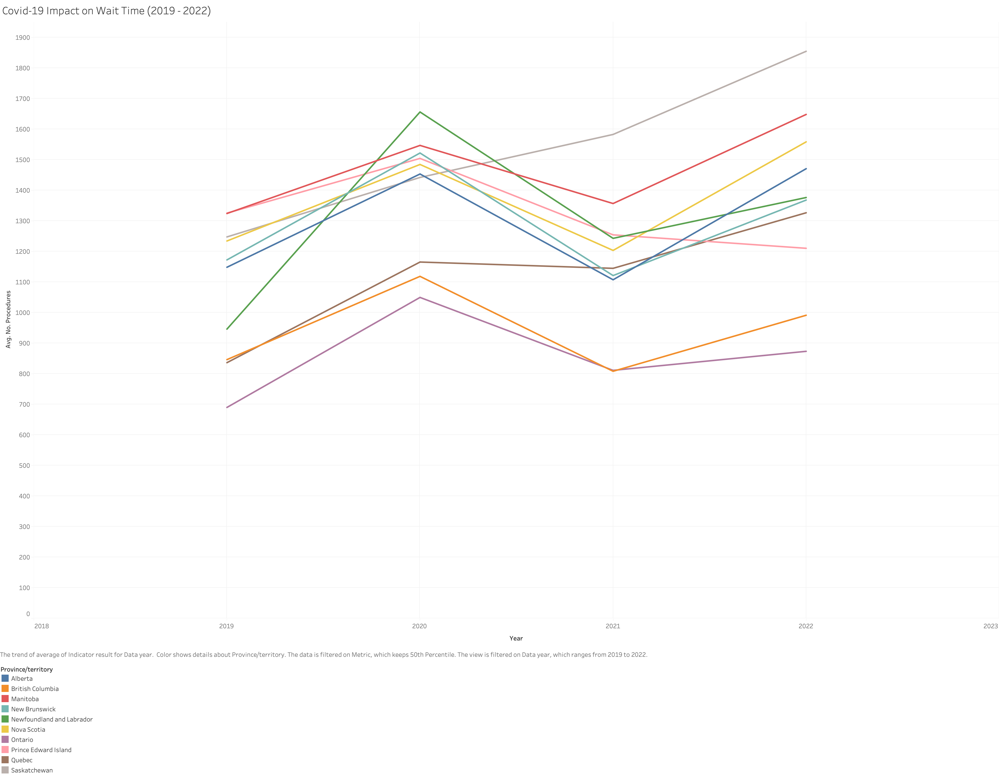
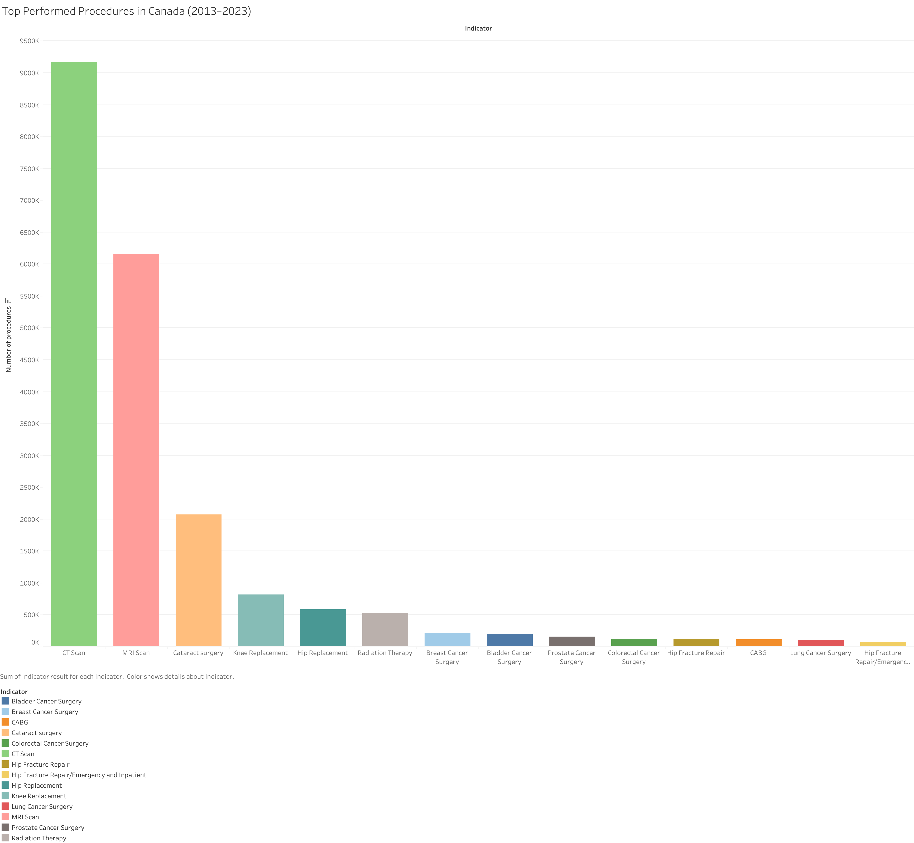
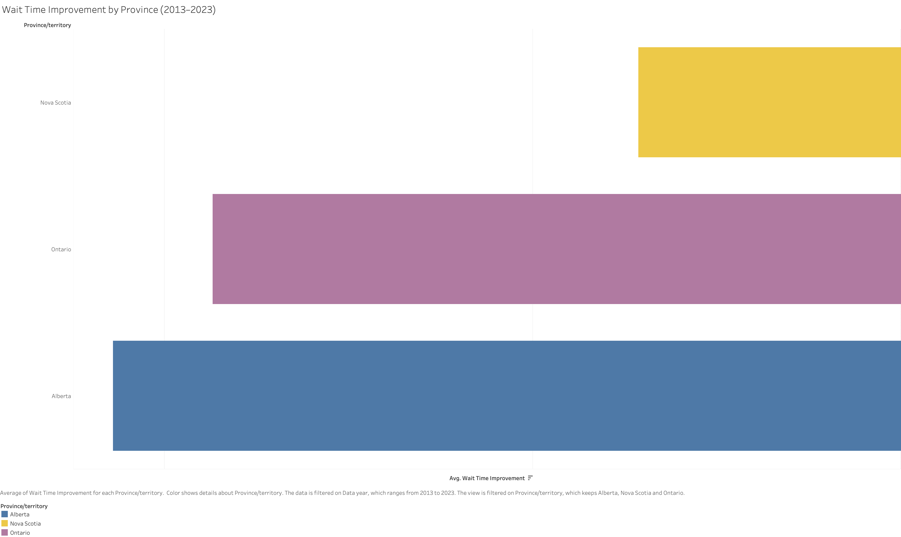
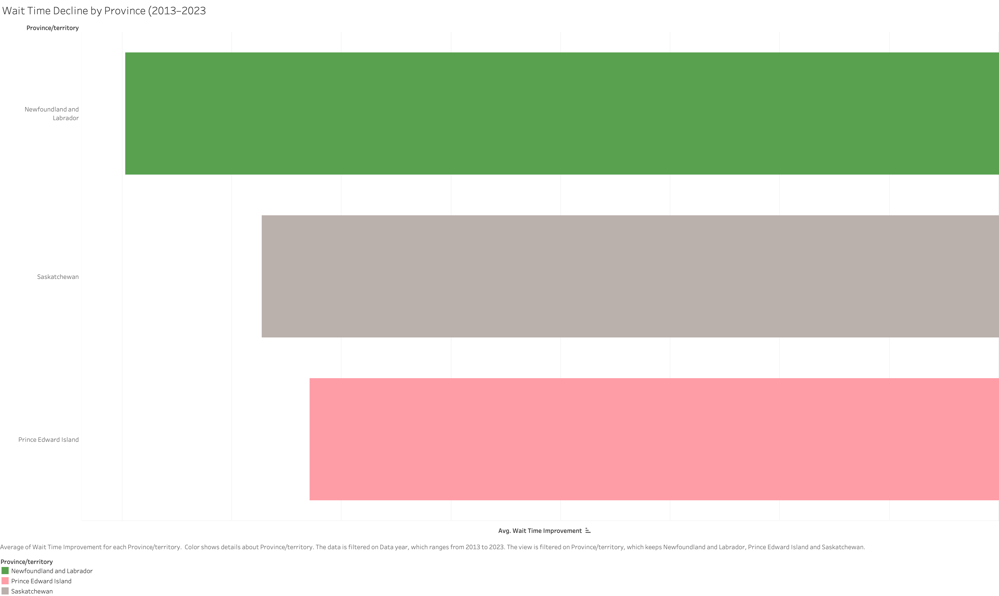

# Analyzing Healthcare Wait Times Across Canadian Provinces (2013–2023)
**Author:** Joshua Ogunbo

A comprehensive analysis of healthcare wait times across Canadian provinces from 2013 to 2023, examining trends, COVID-19 impacts, and provincial performance. This project uses data from the Canadian Institute for Health Information (CIHI) to provide insights into healthcare system efficiency

---

## TOOLS USED
- **Tableau:** Used for creating interactive visualizations and dashboards to analyze wait time trends and provincial performance
- **Jupyter Notebooks:** Used for the data cleaning and preprocessing

## SECTION A - INTRODUCTION

Canada's publicly funded healthcare system is founded on universal access, yet wait times for medical procedures remain a critical issue affecting patient outcomes and satisfaction. Delays in receiving care, especially for procedures like hip replacements, cataract surgeries, MRIs, and CT scans, can reduce quality of life and strain the system's capacity.

Timely access to healthcare remains a pressing concern in Canada, and the main goal of this project is to explore how wait times have evolved across Canadian provinces over the past decade.

As provinces work to improve efficiency and equity within the system, analyzing past wait time trends can provide critical insights to guide future decisions and policy reform.

### Project Objectives:
- Analyze the trend of average wait times for medical procedures in all Canadian provinces between 2013 and 2023.
- Assess the impact of the COVID-19 pandemic (2020–2021) on average national wait times for medical procedures.
- Identify the most frequently performed medical procedures across all Canadian provinces between 2013 and 2023.
- Visualize the top three provinces with the most improvement and most decline in wait time performance across all measured procedures within the time frame.

---

## SECTION B - ANALYSIS QUESTIONS

1. How have average wait times for medical procedures changed over time in all Canadian provinces between 2013 and 2023?

2. What was the effect of the COVID-19 pandemic (2020–2021) on national average wait times for these procedures?

3. Which procedures saw the highest number of cases performed across all provinces between 2013 and 2023?

4. Which top 3 provinces showed the most significant improvement in wait time performance between 2013 and 2023?

5. Which provinces experienced the greatest decline in wait time performance across all measured procedures during the same period?

---

## SECTION C - DATA SOURCING AND JUSTIFICATION

**Dataset Title:** Wait times for priority procedures in Canada, 2024  
**Source:** Canadian Institute for Health Information (CIHI)  
**Link:** [CIHI Dataset](https://www.cihi.ca/en/wait-times-for-priority-procedures-in-canada-2024)

### 1. Reason for Downloading this Dataset
This dataset was chosen because it is aligned with the project's objective, which is Healthcare Wait Times Across Canadian Provinces for key medical procedures. It is publicly available, well-documented, and originates from CIHI, a reputable federal health organization in Canada.

### 2. How the Dataset Supports the Project Objective
The dataset provides historical data on the average wait times and the number of procedures performed per year, broken down by province and procedure.

### 3. Use of Multiple Sources
The selected dataset from CIHI is sufficient for this analysis, as it comprehensively supports the project objectives and addresses all the identified analysis questions.

---

## SECTION D - DATA CLEANING

### Key Cleaning Steps:
- **Standardized Unit of Measurement:** Converted all wait time values from days to hours.
- **Handled Missing Values:** Applied group-wise median imputation, with fallback logic for volumes and deletion for unfixable 50th percentile gaps.
- **Removed Irrelevant Columns:** Dropped 'Region', 'Unnamed', and 'Reporting level' columns.
- **Filtered Time Frame:** Retained only data from 2013–2023.
- **Filtered Metrics:** Removed 90th Percentile and % Meeting Benchmark metrics.

The detailed implementation of these cleaning steps can be found in the `workbook.ipynb` and `pivot_waititime.ipynb` Jupyter notebooks.

---

## SECTION E - VISUALIZATIONS AND FINDINGS

### Question 1a: Procedure Volume Over Time  

**Chart:** Line Chart  
**Finding:** Ontario consistently performed the highest number of medical procedures. Procedure counts dipped in 2020 due to COVID-19 but have since recovered. Smaller provinces had lower and more volatile volumes.

### Question 1b: Wait Time Over Time  
**Chart:** Line Chart  
**Finding:** Most provinces saw increasing wait times up to 2019, with a sharp spike in 2020. Recovery varied, with some provinces returning to pre-COVID levels faster than others.

### Question 2: COVID-19 Impact on Wait Times  
**Chart:** Line Chart (2019–2022)  
**Finding:** All provinces experienced a rise in wait times in 2020. Newfoundland and Labrador, and Saskatchewan were among the hardest hit. Some provinces began to recover by 2021.

### Question 3: Most Performed Procedures  
**Chart:** Bar Chart  
**Finding:** CT Scans and MRI Scans were by far the most frequently performed procedures. Cataract surgery ranked third. Cancer-related and orthopedic surgeries followed with lower counts.

### Question 4: Top 3 Provinces for Wait Time Improvement  
**Chart:** Horizontal Bar Chart  
**Finding:** Nova Scotia achieved the most significant reduction in wait times. Ontario and Alberta also improved, though to a lesser extent.

### Question 5: Top 3 Provinces for Wait Time Decline  
**Chart:** Horizontal Bar Chart  
**Finding:** Newfoundland and Labrador showed the greatest increase in wait times. Saskatchewan and Prince Edward Island also experienced significant declines in wait time performance.

---

## REFERENCES

Canadian Institute for Health Information. (2024). Wait times for priority procedures in Canada, 2024. Ottawa, ON: CIHI. https://www.cihi.ca/en/wait-times-for-priority-procedures-in-canada-2024 [Accessed: May 2025]

Ogunbo, J. (2025). Healthcare Wait Time Analysis Canada. GitHub repository. https://github.com/frontdevguy/healthcare-wait-time-analysis-canada

---
